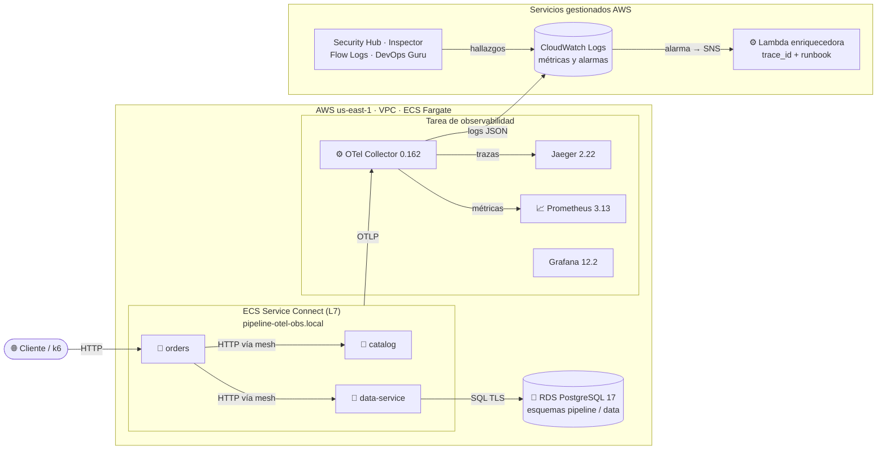
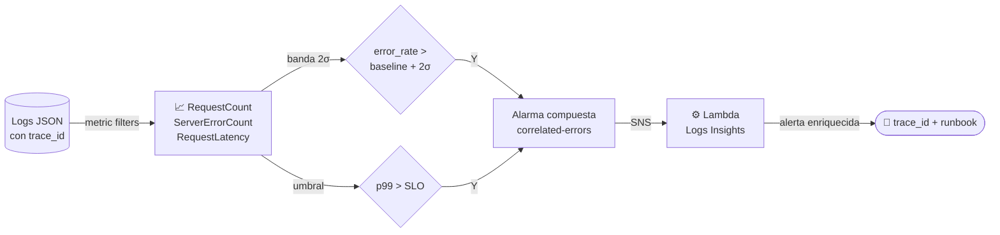

# Arquitectura observable — Actividad 3.3

```mermaid
graph LR
  K6(["🌐 Cliente / k6"])
  subgraph VPC["AWS us-east-1 · VPC · ECS Fargate"]
    direction LR
    subgraph MESH["ECS Service Connect (L7)\npipeline-otel-obs.local"]
      direction TB
      O["🚀 orders"]
      C["🚀 catalog"]
      D["🚀 data-service"]
    end
    RDS[("💾 RDS PostgreSQL 17\nesquemas pipeline / data")]
    subgraph OBS["Tarea de observabilidad"]
      direction TB
      COL["⚙️ OTel Collector 0.162"]
      J["Jaeger 2.22"]
      P["📈 Prometheus 3.13"]
      G["Grafana 12.2"]
    end
  end
  subgraph AWS["Servicios gestionados AWS"]
    direction TB
    CW[("CloudWatch Logs\nmétricas y alarmas")]
    L["⚙️ Lambda enriquecedora\ntrace_id + runbook"]
    SEC["Security Hub · Inspector\nFlow Logs · DevOps Guru"]
  end
  K6 -->|"HTTP"| O
  O -->|"HTTP vía mesh"| C
  O -->|"HTTP vía mesh"| D
  D -->|"SQL TLS"| RDS
  MESH -->|"OTLP"| COL
  COL -->|"trazas"| J
  COL -->|"métricas"| P
  COL -->|"logs JSON"| CW
  CW -->|"alarma → SNS"| L
  SEC -->|"hallazgos"| CW
```

# Regla de correlación (Módulo B)

```mermaid
flowchart LR
  LOG[("Logs JSON\ncon trace_id")] -->|"metric filters"| M["📈 RequestCount\nServerErrorCount\nRequestLatency"]
  M -->|"banda 2σ"| A1{"error_rate >\nbaseline + 2σ"}
  M -->|"umbral"| A2{"p99 > SLO"}
  A1 -->|"Y"| COMP["Alarma compuesta\ncorrelated-errors"]
  A2 -->|"Y"| COMP
  COMP -->|"SNS"| LAM["⚙️ Lambda\nLogs Insights"]
  LAM -->|"alerta enriquecida"| OUT(["📣 trace_id + runbook"])
```
